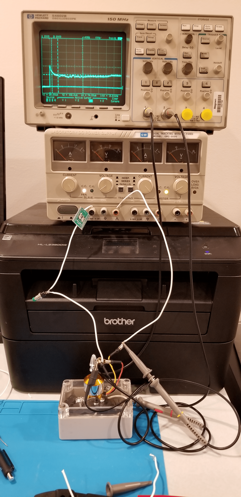
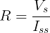
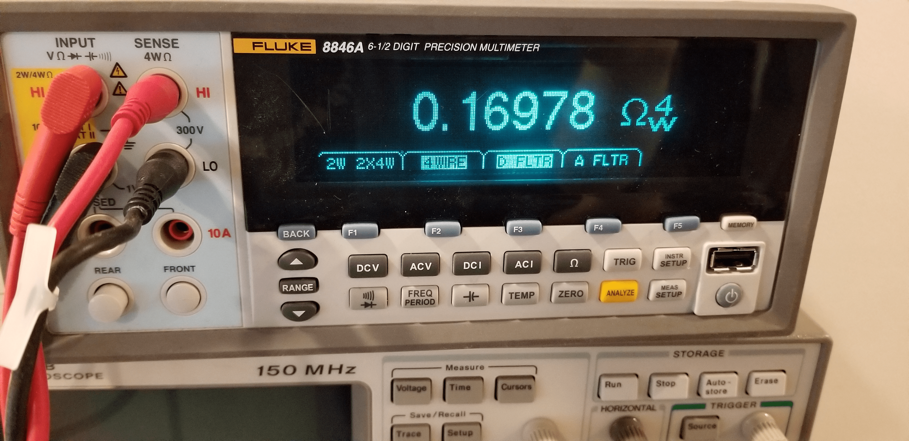
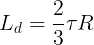
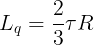
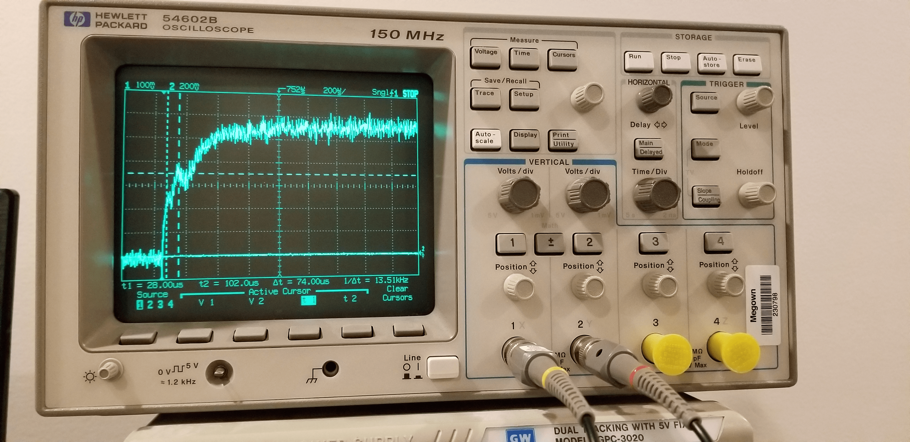

# Brushless DC Motor Model Based System Design
## Purpose
The ultimate purpose of this repository is to demonstrate a model based system design of a BLDC motor controller using simulink. The motor will be a A2212 motor from AliExpress that is commonly used in RC drones. 
## Parameter Identification
The [NXP PMSM Electrical Parameters Measurement](https://www.nxp.com/docs/en/application-note/AN4680.pdf) document is a fantastic resouce for determining your motor parameters. A few caveats for our application are that oscilloscope current probes are quite expensive, and the resistance of our motor to be tested is too low to be measured accurately with a conventional 2 wire multimeter. 
### Test Setup

###  Calculations
The first measurement that needs to be taken is to determine the resistance of the stator. This value could be taken from the datasheet, but the results from my measurements are not consistent with the datasheet, but are reasonably consistent between my 4 wire resistance measurement and oscilloscope measurement. To take this measurement using an oscilloscope simply take a measurment of the voltage drop during steady state current conditions per the equation shown below.

Or, use a 4-wire multimeter as shown below:

### Example Measurement
Shown below is a measurement of one of the key parameters Lq.

## Acknowledgements
[NXP PMSM Electrical Parameters Measurement](https://www.nxp.com/docs/en/application-note/AN4680.pdf)

[A2212 Datasheet](https://www.rhydolabz.com/documents/26/BLDC_A2212_13T.pdf)
